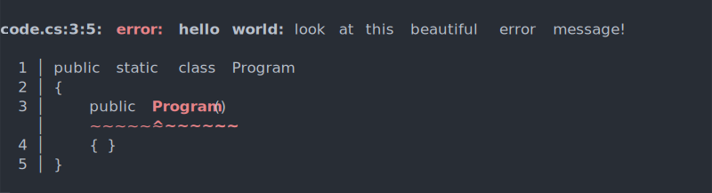
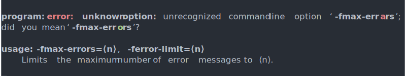
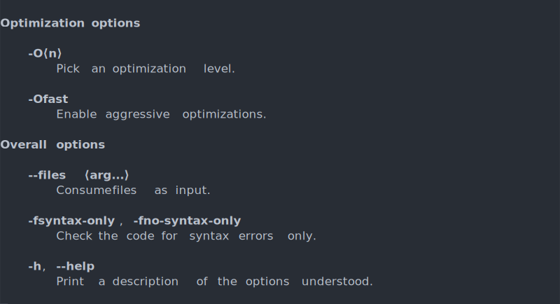
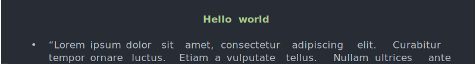
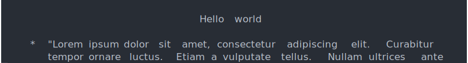
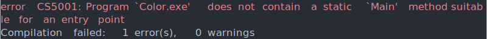
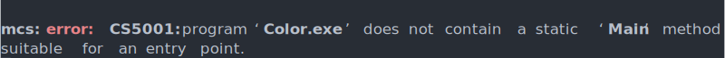
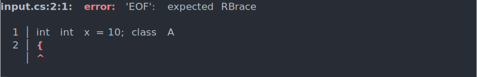

# Pixie

Pixie is a C# library that prints beautifully formatted output to the console. You describe your layout using a high-level API and Pixie turns it into neatly-formatted text.

Essentially, Pixie is all about creating gorgeous console applications with minimal effort.

Key features:

  * **Caret diagnostics.** Pixie has built-in support for caret diagnostics. Want to point out an error in source code? Pixie's really good at that. It highlights the error and colors both the highlighted text and the squiggle beneath it. Pixie also prints line numbers and even throws in a couple of lines of context.

    

  * **Argument parsing.** In addition to formatting application output, Pixie can also parse command-line arguments.

    When parsing command-line arguments, Pixie tries to go the extra mile and guide users toward correct program usage by spellchecking options and proactively printing option usage. Here's what that looks like in action.

    

  * **Help messages.** Help messages are wonderful for users but they're kind of tedious to write and maintain. Pixie generates them automatically from the same data that is used to parse command-line arguments.
  
    Here's an excerpt from an example help message. The formatting, grouping and fancy Unicode characters are all automagically generated by Pixie.

    

  * **Graceful degradation.** Pixie tries to make its output as pretty as your terminal will allow and degrades its output gracefully on terminal implementations that don't support all of Unicode.
  
    For example, when rendered on `xterm` (a Unix terminal), this bulleted list item uses Unicode characters and ANSI control sequences:

    

    The default Windows console doesn't support those features, so Pixie uses ASCII characters and the `System.Console` API there:

    

  * **Pretty output.** Pixie makes a real effort to produce good-looking output. It supports aligning and word-wrapping text. It also has built-in support for common types of messages, like diagnostics (errors, warnings, etc.) and help messages.

    To see why this is something you might want, just take a look at the formatting of `mcs`'s error message below. Note in particular how the word "suitable" is split up awkwardly.

    

    Here's what that error message would have looked like if `mcs` used Pixie. Much better, right?

    

  * **Loyc interop.** Pixie can gracefully translate and log diagnostics produced by [Loyc](https://github.com/qwertie/ecsharp) libraries (including the EC# parser and LeMP). The optional Loyc interop logic is bundled in the `Pixie.Loyc` package, which can be installed in addition to the regular `Pixie` package.

    Here's what a diagnostic produced by Loyc looks like after Pixie has translated it:

    

  * **Customization.** Pixie is customizable: you can easily configure the existing renderers and define your own markup elements and renderers.
