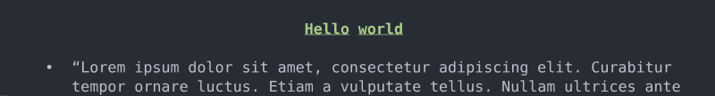
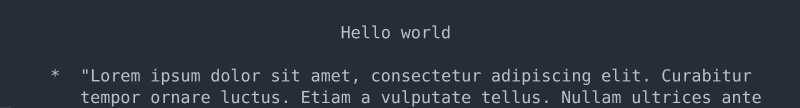

# Terminal Output

`Pixie.Terminal` turns markup trees into terminal output. It handles wrapping, styling, alignment, Unicode support, and graceful degradation.

Most applications can start with `TerminalLog.Acquire()` or `TerminalLog.AcquireStandardOutput()`. Lower-level terminal APIs are for applications that need explicit control.

## Default Acquisition

```cs
using Pixie.Terminal;

var diagnostics = TerminalLog.Acquire();
var output = TerminalLog.AcquireStandardOutput();
```

Use the standard error log for diagnostics and command-line feedback. Use the standard output log when the output is the command's data.

## Manual Terminal Setup

Reach for lower-level terminal APIs when you need to control:

- output width,
- encoding,
- ANSI styling,
- console styling,
- degraded rendering for limited terminals.

`TextWriterTerminal` is the usual starting point for custom output devices.

## Degradation

Markup nodes stay semantic. A color span says text should be colored; it does not say how ANSI escape sequences should be emitted. A bullet list says output is a list; it does not hard-code one bullet character for every terminal.

That division lets Pixie render richer output when the terminal supports it and readable fallback output when it does not.





## See It In Context

The [FormattedList example](https://github.com/jonathanvdc/Pixie/blob/master/Examples/FormattedList/Program.cs) shows a custom terminal configuration and visible degraded output behavior.
