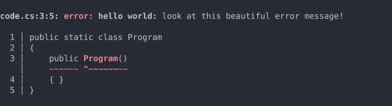
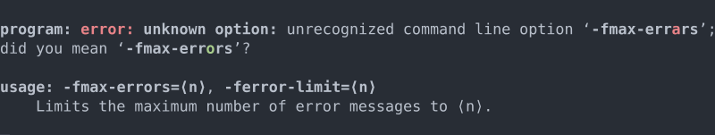
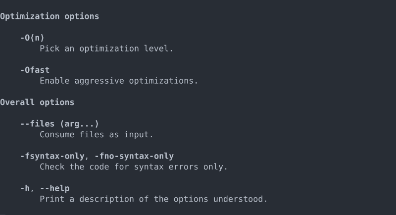

# Pixie Documentation

Pixie is a C# library for polished command-line output. It gives applications a semantic output model for logs, markup, diagnostics, help text, and GNU-style option parsing, then lets terminal renderers choose the best presentation for the current device.

Use Pixie when you want to:

- print structured terminal output without hand-formatting strings,
- report compiler-style diagnostics with source snippets,
- generate help output from the same option definitions you parse,
- keep output readable when ANSI styling or Unicode support is limited.

## Install

```sh
dotnet add package Pixie
```

The `Pixie` package includes both the core APIs and the `Pixie.Terminal` assembly, so most applications only need this one package.

## Start Here

| If you want to... | Read... |
| --- | --- |
| Print your first message | [Getting Started](getting-started.md) |
| Understand Pixie's layers | [Architecture](concepts/architecture.md) |
| Build structured terminal output | [Markup And Layout](guides/markup-and-layout.md) |
| Render compiler-style diagnostics | [Diagnostics](guides/diagnostics.md) |
| Parse command-line options | [Option Parsing](guides/option-parsing.md) |
| Look up types and members | [API Reference](xref:Pixie) |

## Tiny Example

```cs
using Pixie;
using Pixie.Terminal;

var log = TerminalLog.Acquire();

log.Info("Hello from Pixie.");
```

`TerminalLog.Acquire()` writes to standard error, which is the usual place for diagnostics, warnings, help output, and other command-line feedback. Use `TerminalLog.AcquireStandardOutput()` when Pixie is producing normal program output.

## What Pixie Can Render

### Caret Diagnostics

Pixie can render a diagnostic header and a highlighted source snippet from source spans and regions.



### Option Parsing Feedback

Pixie's GNU-style option parser reports mistakes through the same logging and rendering path as the rest of your application output.



### Generated Help

Help output is generated from option definitions, so parsing behavior and user-facing documentation stay aligned.



### Terminal Degradation

Renderers choose output that fits the terminal. Rich terminals get richer output; limited terminals get readable fallbacks.


